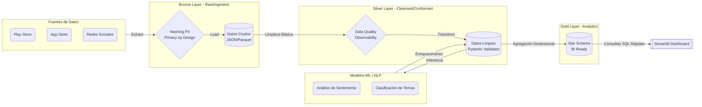
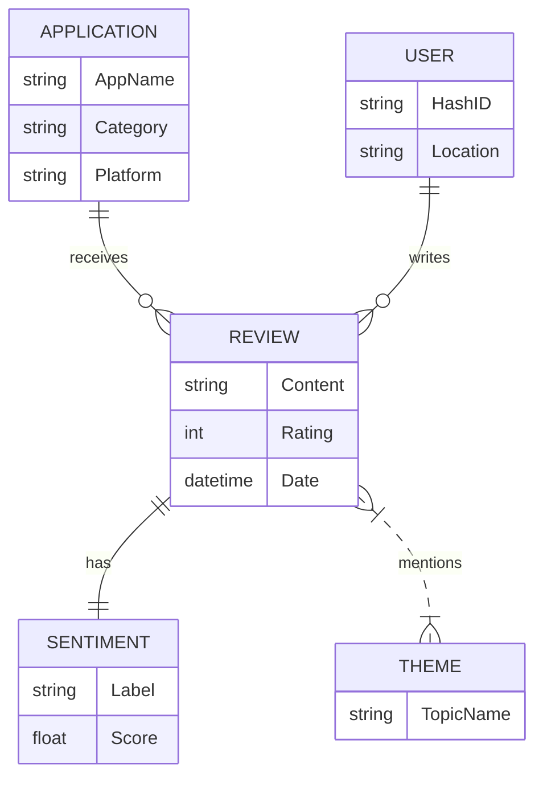
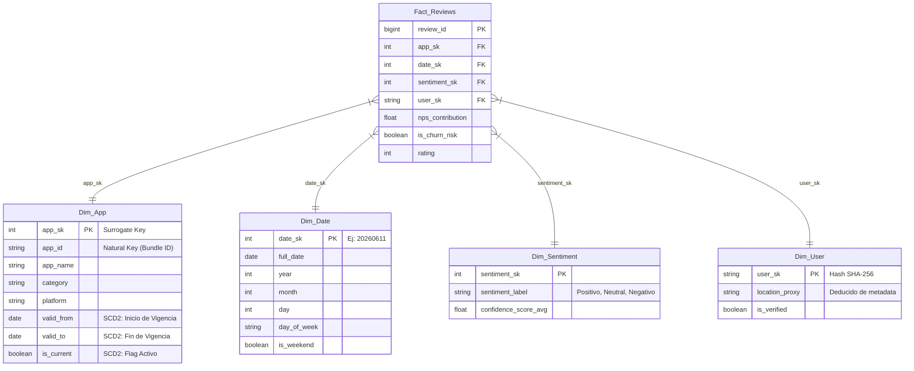

# Arquitectura de Datos y Modelado (Data Architecture & Modeling)

Este documento define la estructura y el viaje de los datos a lo largo de nuestro ecosistema, garantizando rendimiento, trazabilidad histórica y cumplimiento de los requerimientos analíticos B2B.

## 1. Diseño Conceptual: El Flujo Medallón y DAG (Directed Acyclic Graph)

El viaje del dato sigue el paradigma ELT (Extract, Load, Transform), estructurado en tres grandes capas de madurez y orquestado mediante un DAG para garantizar la secuencialidad de las dependencias.

> [!NOTE]
> **OLAP vs OLTP:** Esta arquitectura Medallón (con DuckDB/Parquet) es un motor **OLAP (Online Analytical Processing)** diseñado exclusivamente para lecturas masivas. Las operaciones transaccionales de usuarios SaaS y facturación (OLTP) se separarán en una base PostgreSQL dedicada con RLS (Row Level Security).

---

## 2. Diseño Lógico: Diagrama Entidad-Relación (DER)

A nivel lógico, antes de pensar en tablas analíticas, nuestro dominio de negocio se entiende mediante las siguientes relaciones abstractas entre entidades clave.

---

## 3. Diseño Físico: Star Schema en Capa Gold (DuckDB / Parquet)

Para maximizar el rendimiento del Dashboard, la capa Gold se estructura usando un **Esquema de Estrella (Star Schema)**. Además, implementamos **Slowly Changing Dimensions (SCD) Tipo 2** en dimensiones críticas (como `Dim_App`) para preservar la historia de los cambios (ej. si una app cambia de categoría, no queremos reescribir el pasado).

### Especificaciones de Ingeniería Adicionales

1. **Estrategia de Particionamiento (Partitioning):**
   Los archivos Parquet de las tablas de hechos (`Fact_Reviews`) y la capa Silver estarán particionados físicamente por `year/month/`. Esto permite que DuckDB aplique *Partition Pruning*, leyendo solo los archivos del mes consultado, lo que reduce drásticamente el consumo de RAM y el tiempo de I/O.

2. **SCD Tipo 2 (Slowly Changing Dimensions):**
   Como se observa en `Dim_App`, utilizamos claves subrogadas (Surrogate Keys, `app_sk`). Si la aplicación cambia de nombre o categoría, se inserta una nueva fila en `Dim_App` con un nuevo `app_sk`, se cierra la fecha `valid_to` del registro anterior y se marca `is_current = false`.

3. **Data Quality Gates & Observability:**
   La transición de Bronze a Silver no es automática. Se ejecutarán "Compuertas" (**Data Quality Checks**) en los pipelines que validen esquemas y calidad (Ej. rechazar un registro si un campo clave viene nulo). El objetivo es evitar que la información errónea corrompa la capa Silver.

4. **Cifrado en Tránsito y Reposo (ISO 27001):**
   Todo dato en tránsito viaja usando protocolos seguros (HTTPS/TLS). Los archivos Parquet de la capa Bronze en reposo estarán cifrados usando KMS (AES-256) garantizando la confidencialidad.

5. **Carga Incremental y CDC (Change Data Capture):**
   A medida que el volumen escale, el pipeline evolucionará hacia una arquitectura CDC para inyectar solo los registros nuevos o modificados, manteniendo un registro auditable del **Data Lineage** para certificar la procedencia de cada fila en la capa Gold.
